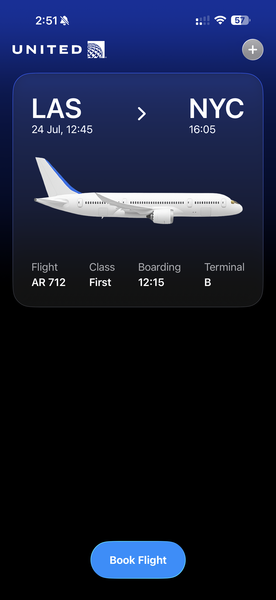
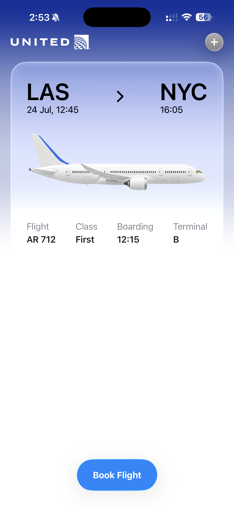

# United Airlines - Flight Booking UI

A beautiful SwiftUI recreation of a flight ticket interface, featuring Apple's **Liquid Glass** design language for a modern, premium user experience.


## Design Inspiration

This project is inspired by the [Flight Ticket UI Design](https://dribbble.com/shots/6776366-Flight-ticket-UI-design) by Dribbble. The implementation focuses on recreating the elegant interface while leveraging Apple's latest **Liquid Glass** material system for enhanced visual depth and fluidity.

## Key Implementation Details

### Liquid Glass Effects

**Advanced Mesh Gradient**
```swift
MeshGradient(
    width: 5, height: 7,
    points: [/* 35 precisely positioned points */],
    colors: [/* Gradient from United blue to system background */]
)
```

**Glass Material Application**
```swift
.glassEffect(.clear, in: .rect(cornerRadius: 30, style: .continuous))
.glassEffect(.regular.tint(.blue).interactive(), in: .capsule)
```

## Screenshots

### Dark Mode


### Light Mode  


*The app seamlessly adapts between dark and light modes, showcasing the power of Liquid Glass materials and adaptive color systems.*

## Resources

- [Apple's Liquid Glass Documentation](https://developer.apple.com/documentation/TechnologyOverviews/adopting-liquid-glass)
- [SwiftUI Glass Effects](https://developer.apple.com/documentation/swiftui/applying-glass-effects)
- [Original Design by Dribbble](https://dribbble.com/shots/6776366-Flight-ticket-UI-design)

## License

This project is licensed under the MIT License - see the [LICENSE](LICENSE) file for details.

## Acknowledgments

- **Design Inspiration**: [Flight Ticket UI Design](https://dribbble.com/shots/6776366-Flight-ticket-UI-design) on Dribbble
- **Apple**: For the incredible Liquid Glass design system
- **United Airlines**: For the brand assets and inspiration

---

**Built with ❤️ using SwiftUI and Liquid Glass**

*This is a UI recreation project for educational and portfolio purposes.* 